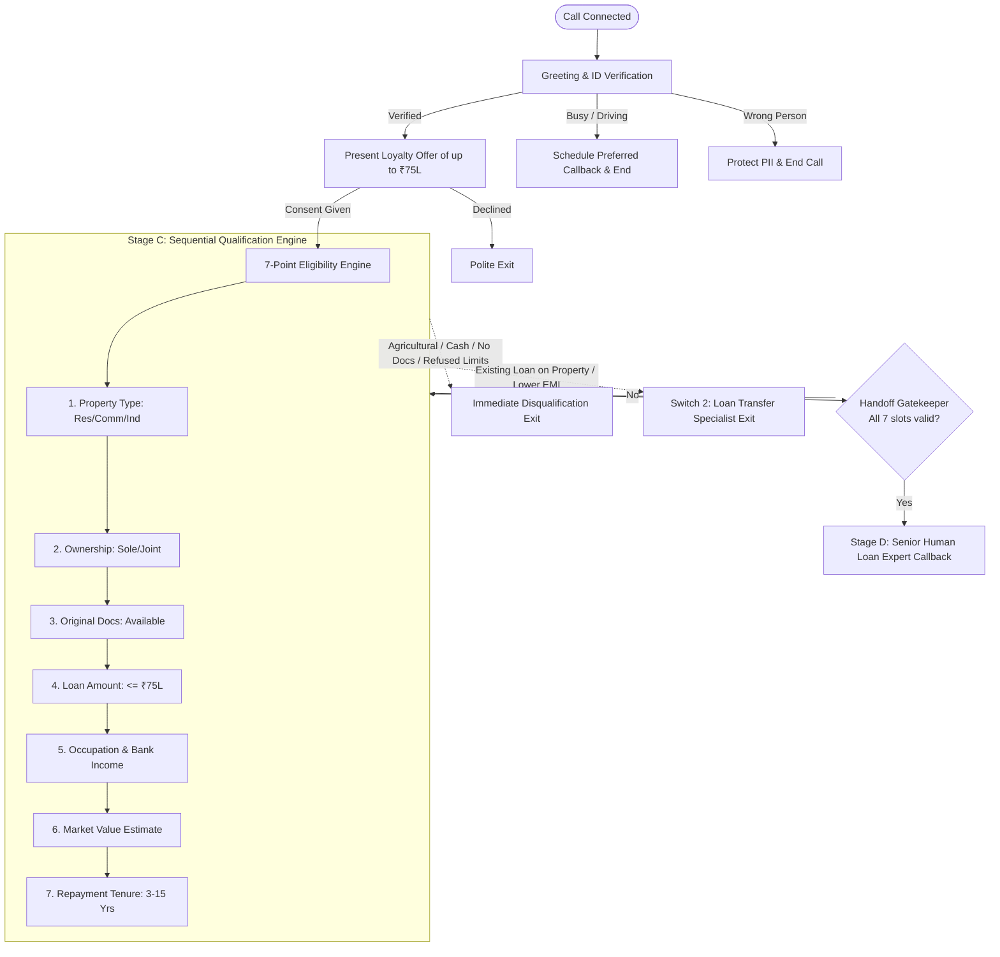

# Assignment Submission: AI Voice Agent Design for Home Credit LAP Qualification
**Candidate:** Patha Snehith  
**Target Role:** AI Intern / Prompt Engineer  
**Organization:** SalesAgents AI  
**Repository:** [https://github.com/PathaSnehith/home-credit-lap-voice-agent](https://github.com/PathaSnehith/home-credit-lap-voice-agent)  
**Usecase:** Home Credit Loan Against Property (LAP) Loyalty Qualification  

---

## 1. Executive Summary
This project implements an end-to-end, production-grade AI Voice Agent designed to qualify existing Home Credit customers for a pre-approved Loan Against Property (LAP) offer of up to ₹75,00,000 (seventy-five lakh rupees).

The voice agent is built with:
1. **Advisory Relationship-Manager Tone:** Friendly, polite, and unhurried while adhering to strict voice-first brevity (1–2 sentences per turn).
2. **7-Point Qualification State Machine:** Sequentially evaluates Property Type, Ownership, Document Availability, Loan Amount, Occupation & Income Mode, Market Value, and Repayment Tenure.
3. **Out-of-Order Slot Extraction:** Dynamically detects and extracts multiple parameters if volunteered out of order by the customer, preventing redundant questions.
4. **Immediate Disqualification Boundary:** Respectfully exits without debate when hard criteria fail (Agricultural property, Cash income, Unavailable original documents, Refusal of ₹75L cap or 3–15 year tenure).
5. **The "Transfer" Logic Switch:** Intelligently identifies callers with existing loans on the property or seeking EMI reduction / balance transfer, routes them to a specialized loan transfer team, and cleanly terminates the fresh-loan flow.
6. **Mandatory Handoff Gatekeeper:** Guarantees that no customer is handed off to a senior expert callback until all 7 checklist slots are fully validated and confirmed.
7. **Production Voice Platform Ready:** Engineered for Retell AI, Bolna, and Vapi with phonetic number handling, strict gender/language agreement, zero markdown in spoken outputs, and zero PII collection.

---

## 2. Dynamic Variables & Technical Specifications
The system prompt integrates all 9 mandatory specification variables:
- `company_name`: Home Credit
- `customer_name`: Name of customer being contacted
- `agent_name`: Name of the AI assistant (e.g., Priya / Rahul)
- `agent_gender`: Gender strictly adhered to in grammar ("bol rahi hoon" / "bol raha hoon")
- `current_date` / `current_day` / `current_time`: Real-time contextual temporal grounding for callback scheduling
- `additional_context_from_rag`: Retrieved product facts (used only when present; never hallucinates)
- `language_to_speak`: English or Hindi/Hinglish
- `conversation_history`: Log of current multi-turn dialogue
- `customer_utterance`: Latest caller statement

---

## 3. Production System Prompt
The complete prompt is maintained in [prompts/system_prompt.md](prompts/system_prompt.md). A web playground ready-to-paste version with fallback defaults is located in [prompts/retell_direct_copy_paste.txt](prompts/retell_direct_copy_paste.txt).

---

## 4. Architectural State Machine & Flowchart
Detailed state machine specifications, decision matrices, and Mermaid diagrams are available in [docs/conversation_flow.md](docs/conversation_flow.md).

---

## 5. Test Suite & Verification Results
An automated test runner was developed in [tests/simulate_call.py](tests/simulate_call.py) which executes against all scenarios. Full manual dialogue transcripts and evaluation criteria are documented in [tests/test_scenarios.md](tests/test_scenarios.md).

### Summary of Test Execution:
1. **T01 - Golden Path (Fully Eligible):** Residential flat, sole owner, original documents, ₹50 lakh, salaried with bank deposit, ₹1.2 Cr market value, 10 years tenure. -> **PASSED** (Qualified handoff to expert callback).
2. **T02 - Security & Wrong Person:** Third party answers; agent does not reveal loan offer or customer details; ends call politely. -> **PASSED**.
3. **T03 - Busy Customer:** Caller driving; acknowledges, schedules preferred callback with time context, ends call cleanly. -> **PASSED**.
4. **T04 - Agricultural Land Disqualification:** Farmland detected; stops checklist immediately; executes polite exit line. -> **PASSED**.
5. **T05 - Cash Income Disqualification:** Cash salary / retail cash; stops checklist immediately; exits gracefully. -> **PASSED**.
6. **T06 - Unavailable Original Documents:** Photocopies only; stops checklist; exits gracefully. -> **PASSED**.
7. **T07 - Loan Amount > ₹75 Lakh Cap:** Customer asks for ₹1.2 Cr; agent explains ₹75L cap; customer accepts; successfully proceeds. -> **PASSED**.
8. **T08 - Loan Amount Cap Refused:** Customer insists on ₹1.5 Cr; agent politely exits call. -> **PASSED**.
9. **T09 - Switch 2 (Transfer Switch):** Existing home loan on property / lower EMI requested; routes immediately to Loan Transfer Specialist; ends call cleanly. -> **PASSED**.
10. **T10 - Tenure Out of Bounds Adjusted:** 20 years requested; agent explains 3–15 year range; customer selects 12 years; successfully proceeds. -> **PASSED**.
11. **T11 - Out-of-Order Multi-Slot Extraction:** Customer volunteers property type, ownership, amount, and tenure in one turn; agent extracts all 4 slots, confirms them, and only asks for remaining 3. -> **PASSED**.
12. **T18 - Handoff Gatekeeper Integrity:** Customer diverts after Q3 to ask about interest rates; agent answers without hallucinating and circles back to Q4 before allowing handoff. -> **PASSED**.

---

## 6. Retell AI Platform Deployment & Public Recording Links
To test on Retell AI:
1. Agent configuration settings are provided in [prompts/retell_agent_config.json](prompts/retell_agent_config.json).
2. A 3-minute, zero-friction testing guide is provided in [TESTING_CHEATSHEET.md](TESTING_CHEATSHEET.md).

### Public Submission Links:
- **Retell AI Agent Name:** `Home Credit LAP Qualification Assistant`
- **Public Call Recording Link (Audio + Transcript):** `[INSERT_RETELL_PUBLIC_CALL_LINK_HERE]`
- **Alternative / Secondary Test Call Link:** `[INSERT_SECONDARY_CALL_LINK_HERE]`
- **System Prompt File:** [prompts/system_prompt.md](prompts/system_prompt.md)
