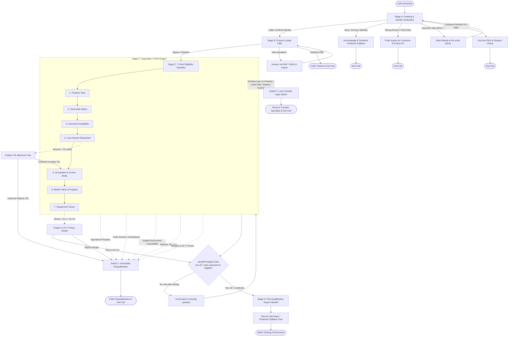

# Conversation Flow & State Architecture: Home Credit LAP Voice Agent

This document defines the conversational state machine, branching logic, verification gates, and boundary switches for the Home Credit Loan Against Property (LAP) AI Voice Agent.

---

## 1. High-Level Conversational Flow Architecture

---

## 2. Conversational State Machine Definition

| State ID | State Name | Purpose | Entry Condition | Exit Condition |
| :--- | :--- | :--- | :--- | :--- |
| **S0** | `INITIATE_CALL` | Initiate outbound call, load customer context. | Call answered | Audio session active |
| **S1** | `GREET_VERIFY` | Confirm speaking with target customer (`customer_name`). | Audio connected | Confirmed / Busy / Wrong person |
| **S2** | `PRESENT_OFFER` | Disclose pre-approved LAP offer up to ₹75 lakh. | `identity_verified == TRUE` | Consent given / Refused |
| **S3** | `COLLECT_ELIGIBILITY`| Sequentially collect 7 criteria slots (handling out-of-order slots). | Consent given | All 7 slots filled OR early exit |
| **S4** | `CAP_NEGOTIATION` | Negotiate ₹75 lakh maximum ceiling if customer asks for more. | `loan_amount > 75 Lakhs` | Accepted ₹75L / Disqualified |
| **S5** | `TENURE_RESOLUTION`| Resolve tenure requests outside the 3–15 year range. | `tenure < 3` or `tenure > 15` | Accepted range / Disqualified |
| **S6** | `TRANSFER_ROUTING`| Route balance transfer / existing loan leads to transfer specialist. | Existing loan / EMI reduction | Specialist notification & hangup |
| **S7** | `DISQUALIFICATION` | Respectfully exit without negative feedback or arguing. | Any hard criterion failed | Polite disconnect |
| **S8** | `HANDOFF_GATE` | Integrity gate: verify 100% completion of all 7 data points. | All questions initiated | Pass to S9 or backtrack |
| **S9** | `EXPERT_HANDOFF` | Congratulate on preliminary qualification, set expectations. | All 7 points valid | Call completed |

---

## 3. The 7-Point Qualification Matrix

| # | Data Point | Prompt Question | Eligible Criteria | Disqualification Trigger | Notes / Exceptions |
| :-: | :--- | :--- | :--- | :--- | :--- |
| **1** | **Property Type** | Residential, Commercial, or Industrial? | Residential (flat/house), Commercial (shop/office), Industrial (factory). | Agricultural / Farmland / Kheti. | If mixed use, ask for primary registered usage. |
| **2** | **Ownership Status** | Solely owned or jointly owned? | Sole or Joint (with family/business partners). | None (both eligible). | Do not collect co-owner PII on call. |
| **3** | **Original Documents**| Original title deeds available for verification? | Yes, originals available with customer. | No, lost, or photocopies only. | If originals with another bank for active loan -> Route to **TRANSFER**, do not disqualify! |
| **4** | **Loan Amount** | How much loan amount looking to borrow? | Up to ₹75,00,000 (seventy-five lakh rupees). | Rejecting ₹75 lakh maximum cap. | If > 75L, prompt with cap. If accepted, eligible. |
| **5** | **Occupation & Mode**| Salaried or Self-Employed? Bank or Cash? | Salaried or Self-Employed **AND** income via Bank. | Income in Cash; Unemployed with no income. | Both occupation AND mode required. Re-prompt if partial. |
| **6** | **Market Value** | Approximate current market value? | Any realistic valuation estimate. | None (no minimum cutoff). | Ballpark estimates accepted. Unsure recorded as pending. |
| **7** | **Tenure** | In how many years would you repay? | 3 to 15 years inclusive. | Insisting on < 3 or > 15 years after range explanation. | Convert months to years (36 months = 3 years). |

---

## 4. Boundary Logic & Logic Switches

### Switch 1: Immediate Disqualification Engine
- **Triggers:**
  1. `property_type == "Agricultural"`
  2. `income_mode == "Cash"`
  3. `original_docs == "No"`
  4. Refusal to proceed with ₹75 Lakh cap
  5. Refusal of 3–15 year repayment window
- **Execution Protocol:**
  - Break checklist immediately.
  - Deliver graceful exit line: *"I understand, {{customer_name}}. Unfortunately, based on our current policy guidelines, you do not meet the preliminary criteria for this specific pre-approved offer at this time. Thank you so much for your time, and have a wonderful day."*
  - Disconnect call cleanly. Never argue or promise external workarounds.

### Switch 2: The "Transfer" Logic Switch
- **Triggers:**
  1. Customer mentions an existing active loan on the property (Home Loan / LAP / Mortgage).
  2. Customer asks to reduce their current monthly EMI.
  3. Customer mentions Balance Transfer (BT) from another bank/NBFC.
- **Execution Protocol:**
  - Standard LAP is strictly for *Fresh Loans*.
  - Immediately stop checklist.
  - Deliver transfer handoff line: *"I understand, {{customer_name}}. Since you have an existing loan on the property and are looking for a loan transfer or lower EMI, our specialized Loan Transfer expert will contact you shortly to assist you. Thank you for your time, and have a great day!"*
  - Disconnect call cleanly.

### Switch 3: The Mandatory Handoff Gatekeeper
- **Gatekeeper Rule:** No caller shall be informed of eligibility or transitioned to the senior expert callback unless all 7 slots evaluate to `VALID`.
- **Handling Diversions:** If a customer asks a diversionary question (e.g., "What will be my monthly interest rate?") in the middle of the checklist:
  1. Answer concisely: "The senior expert will share exact personalized interest rates on the callback."
  2. Perform state reconciliation check: Is any previous slot empty?
  3. Seamlessly resume the first unanswered slot: "To make sure we can qualify you for those rates, may I know [missing question]?"

---

## 5. Security, Fraud Prevention & Anti-Hallucination Guardrails

1. **Third-Party Confidentiality:** If the person answering is a spouse, child, colleague, or roommate, the agent MUST NOT disclose loan amounts, property offers, or loyalty status. Only verify if the customer is available.
2. **Zero PII Collection:** The voice agent is strictly forbidden from soliciting OTPs, Aadhaar numbers, PAN numbers, bank account numbers, or debit/credit card details. If the customer volunteers them, immediately stop them.
3. **Deterministic Financial Values:** The agent must never calculate or invent EMI figures, processing fee percentages, or interest rate percentages. Defer all terms to the senior human loan expert.
4. **Phonetic Currency & Numbers:** All numerical figures must be delivered in words ("seventy-five lakh rupees", "ten years") to prevent Text-to-Speech (TTS) synthesizer glitches.
